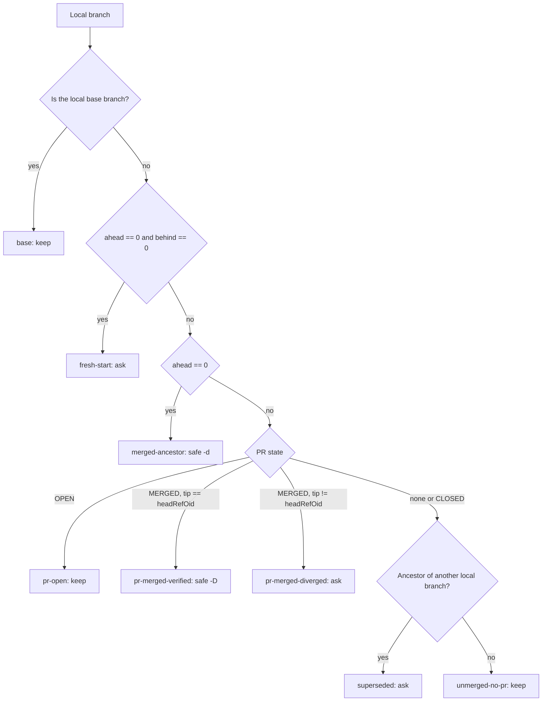

# Classification

How `audit.sh` turns raw git and GitHub signals into a category and a
disposition. Read this when a classification surprises you, or when you want to
extend the matrix.

## Signals

Each signal is collected once per audit, not once per branch, wherever the git
plumbing allows it.

| Signal | Command | Notes |
| ------ | ------- | ----- |
| Tip commit | `git for-each-ref --format='%(objectname)' refs/heads` | One call for all branches |
| Ahead / behind | `git rev-list --left-right --count "$BASE...$branch"` | Left is behind, right is ahead; one call gives both |
| Ancestry | derived: `ahead == 0` | A branch with no commits outside base *is* an ancestor of base, so the `merge-base --is-ancestor` call is redundant |
| Live on remote | `git ls-remote --heads <remote>` | One round trip for the whole repo |
| PR state | `gh pr list --author @me --state all` | One round trip; gaps filled per branch |
| PR for a commit | `gh api repos/{owner}/{repo}/commits/<sha>/pulls` | Only for detached worktrees |
| Worktree occupancy | `git worktree list --porcelain` | Also yields `detached`, `locked`, `prunable` |
| Worktree cleanliness | `git -C <path> status --porcelain` | One call per worktree |
| Worktree size | `du -sk <path>` | Skippable with `--no-size`; the slowest step |

### Why not trust `[gone]`

`git for-each-ref`'s `%(upstream:track)` reports `[gone]` from the local
remote-tracking refs, which are only as current as the last `git fetch --prune`.
A branch can be deleted on the remote for weeks and still look live locally, or
be marked gone after someone else re-pushed it. `git ls-remote` asks the remote
what exists right now, for the cost of one round trip, so the audit uses that
and ignores the marker entirely.

### Why one batched PR query

Calling `gh pr list --head <branch>` once per branch costs a round trip each;
across twenty branches that dominates the runtime. A single
`gh pr list --author @me --state all` returns everything you authored, and the
join happens locally. Branches the batch misses — someone else's work you
checked out — get one targeted lookup each, so the common case stays at one
call while the uncommon case stays correct.

When several PRs share a head branch (a reused branch name), the audit picks
one: `OPEN` wins, then the most recently merged, then closed.

## Decision order

The first matching rule wins. Order matters: `fresh-start` is checked before
ancestry because a branch identical to base is technically an ancestor of it,
and the ancestry rule would otherwise mark it safe to delete.

## The categories

### `base`

The local branch matching the base ref, for example `main` when the base is
`origin/main`. Excluded from cleanup so a stale local `main` is never proposed
for deletion.

### `fresh-start`

Tip is identical to the base tip: zero ahead, zero behind. Nothing distinguishes
this branch from `main` except its name, which is exactly the point — the name
records an intention. It is the output of `git checkout -b` before the first
commit.

Never auto-safe. Ask, and mention how recently it was created.

### `merged-ancestor`

Zero commits outside base, but behind it. Every commit is reachable from base,
so `git branch -d` succeeds and nothing can be lost. This is the only category
where deletion is unconditionally lossless.

### `pr-merged-verified`

The branch has commits outside base, but a merged PR claims it and the local tip
equals that PR's `headRefOid`. Under a squash merge the branch's commits never
enter main's history — main gets one new commit with a different SHA — so git
sees the branch as unmerged and `-d` refuses.

The `headRefOid` check is what makes `-D` defensible: it proves the local tip is
byte-for-byte the commit GitHub squashed. Without that check, `-D` is a guess.

### `pr-merged-diverged`

A merged PR claims the branch, but the local tip has moved past the commit that
was merged. Someone committed after the merge — a follow-up fix, or a rebase
that was never pushed. Those commits exist nowhere else.

Always ask. `report.md` includes the `git log --oneline base..branch` command
that shows exactly what would be lost.

### `pr-open`

An open PR points at this branch. Never offered for deletion at any scope.

### `unmerged-no-pr`

Commits outside base and no PR, or a PR that was closed without merging. Work in
progress. Kept by default; the report carries the ahead count, the last commit
date, and the subject so a human can decide whether it is still alive.

### `superseded`

The branch has no PR of its own and its tip is an ancestor of another local
branch — a checkpoint that later work grew past. Nothing is lost by deleting it
because the successor contains every commit, but the name may still be load
bearing, so it asks.

This scan is O(n²) in branch count, so it runs only for branches that would
otherwise be `unmerged-no-pr`.

## Worktrees

Checked in order; the first match wins.

| Category | Test | Disposition |
| -------- | ---- | ----------- |
| `prunable` | Porcelain says `prunable`, or the directory is gone | safe: `git worktree prune` |
| `primary` | First entry from `git worktree list` | keep |
| `current` | Path equals the toplevel you invoked from | keep |
| `locked` | Porcelain says `locked` | keep |
| `dirty` | `git status --porcelain` is non-empty | keep |
| `stale-merged` | Clean, and holds a branch whose disposition is safe | safe: `git worktree remove` |
| `ask` | Clean, and holds a branch whose disposition is ask | ask |
| `active` | Clean, and holds a branch that is kept | keep |
| `stale-merged` | Detached at a commit already in base, or at a merged/closed PR head | safe: `git worktree remove` |
| `active-open-pr` | Detached at an open PR's head commit | ask |
| `unknown` | Detached, not in base, no PR match | ask |

Detached worktrees are classified from the commit, never from the directory
name. Review tooling names directories things like `pr-1280-91a76b76`, but that
string is a convention, not data — the commit is data. `git merge-base
--is-ancestor` answers whether the work landed, and the commits API answers
which PR it belongs to even when someone else opened it.

## Extending the matrix

To add a category:

1. Add the branch to `test_audit.sh`'s scratch repo and assert the category you
   expect. It will fail.
2. Add the rule to `classify_branches` in `audit.sh`, respecting the order
   above.
3. Map it to a disposition (`safe-d`, `safe-D`, `ask`, `keep`) and, if it is
   safe, emit its command in the remediation block in the correct position.
4. Document it here and in the SKILL.md table.

Every field written to a TSV must be non-empty — use `-` as the placeholder.
With a tab `IFS`, bash collapses runs of whitespace delimiters, so an empty
middle field silently shifts every later column left.
