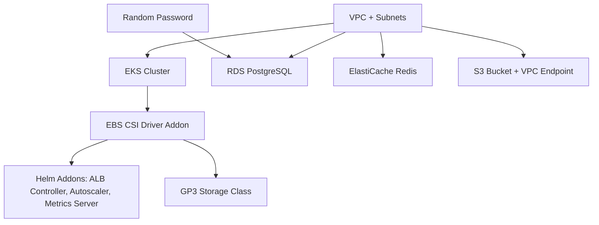

# Architecture

Pulumi package that provisions the full LangSmith Hybrid stack on AWS.

## Project Structure

```
langsmith-hosting/
├── Pulumi.yaml              # Project config (Python runtime, shared venv)
├── Pulumi.dev.yaml           # Dev stack config (AWS profile, region, sizing)
├── pyproject.toml            # Dependencies (pulumi, pulumi-aws, pulumi-eks, ...)
├── README.md
├── docs/
│   └── architecture.md       # This file
└── src/
    └── langsmith_hosting/
        ├── __init__.py
        ├── __main__.py       # Entry point: wires all modules, exports outputs
        ├── config.py         # Typed config loading from Pulumi stack config
        ├── constants.py      # PROJECT_NAME, TAGS
        ├── vpc.py            # VPC + subnets
        ├── eks.py            # EKS cluster + node group + addons
        ├── postgres.py       # RDS PostgreSQL
        ├── redis.py          # ElastiCache Redis
        └── s3.py             # S3 bucket + VPC endpoint
```

## Resource Dependency Chain

Dependencies are expressed through Pulumi output references -- when one resource
consumes the output of another, Pulumi automatically creates and respects the
dependency ordering.



## Module Details

### `__main__.py` -- Entry Point

Orchestrates all modules in order:

1. Loads `.env` and Pulumi stack config via `config.py`
2. Gets AWS caller identity and region
3. Creates VPC
4. Creates EKS cluster (depends on VPC)
5. Creates PostgreSQL (depends on VPC + random password)
6. Creates Redis (depends on VPC)
7. Creates S3 bucket (depends on VPC)
8. Exports stack outputs

### `config.py` -- Configuration

Reads `Pulumi.<stack>.yaml` values into a frozen `LangSmithConfig` dataclass.
Every Terraform variable from the original project has a corresponding config
key with sensible defaults:

| Config Key | Type | Default |
|---|---|---|
| `environment` | str | *(required)* |
| `vpcCidr` | str | `10.0.0.0/16` |
| `eksClusterName` | str | *(required)* |
| `eksClusterVersion` | str | `1.31` |
| `eksNodeInstanceType` | str | `m5.large` |
| `eksNodeMinSize` | int | `2` |
| `eksNodeMaxSize` | int | `5` |
| `eksNodeDesiredSize` | int | `2` |
| `postgresInstanceClass` | str | `db.t3.medium` |
| `postgresEngineVersion` | str | `16.6` |
| `postgresAllocatedStorage` | int | `20` |
| `postgresMaxAllocatedStorage` | int | `100` |
| `redisNodeType` | str | `cache.t3.micro` |
| `s3BucketPrefix` | str | `langsmith` |

### `vpc.py` -- VPC

Uses `pulumi_awsx.ec2.Vpc` to create:

- VPC with configurable CIDR block
- Public and private subnets across 3 availability zones
- Single NAT gateway
- Subnet tags for EKS auto-discovery (`kubernetes.io/cluster/<name>`)

### `eks.py` -- EKS Cluster

Uses `pulumi_eks.Cluster` and related resources to create:

- **IAM role** for worker nodes with policies: EKSWorkerNodePolicy, EKS_CNI_Policy, EC2ContainerRegistryReadOnly, EBSCSIDriverPolicy
- **EKS cluster** with API authentication mode
- **Managed node group** with configurable instance type and scaling
- **Kubernetes provider** from the cluster kubeconfig
- **EBS CSI driver addon** (`aws-ebs-csi-driver`)
- **GP3 storage class** set as cluster default
- **Helm addons**:
  - AWS Load Balancer Controller
  - metrics-server
  - cluster-autoscaler

### `postgres.py` -- RDS PostgreSQL

Uses `pulumi_aws.rds` and `pulumi_random` to create:

- **Random password** (32 characters, no special characters)
- **DB subnet group** in private subnets
- **Security group** allowing port 5432 from VPC CIDR
- **RDS instance** with PostgreSQL engine, encrypted storage, no public access

Outputs include a full `postgresql://` connection URL.

### `redis.py` -- ElastiCache Redis

Uses `pulumi_aws.elasticache` to create:

- **Cache subnet group** in private subnets
- **Security group** allowing port 6379 from VPC CIDR
- **ElastiCache cluster** running Redis 7.0 with a single node

### `s3.py` -- S3 Bucket

Uses `pulumi_aws.s3` and `pulumi_aws.ec2` to create:

- **S3 bucket** named `<prefix>-<env>-<account_id>` with AES256 encryption
- **Public access block** denying all public access
- **VPC gateway endpoint** for S3 (routes traffic within the VPC)
- **Bucket policy** restricting access to the VPC endpoint only

## Exports

The stack exports the following values (accessible via `pulumi stack output`):

| Output | Description |
|---|---|
| `aws_account_id` | AWS account ID |
| `aws_region` | AWS region |
| `vpc_id` | VPC ID |
| `private_subnet_ids` | Private subnet IDs |
| `eks_cluster_name` | EKS cluster name |
| `eks_oidc_provider_arn` | EKS OIDC provider ARN (for IRSA) |
| `postgres_connection_url` | PostgreSQL connection URL (sensitive) |
| `s3_bucket_name` | S3 bucket name |
| `kubectl_config_command` | Command to configure kubectl |

## Configuration

Stack-specific config lives in `Pulumi.<stack>.yaml` (e.g., `Pulumi.dev.yaml`).
See the [README](../README.md) for the full configuration reference table.
